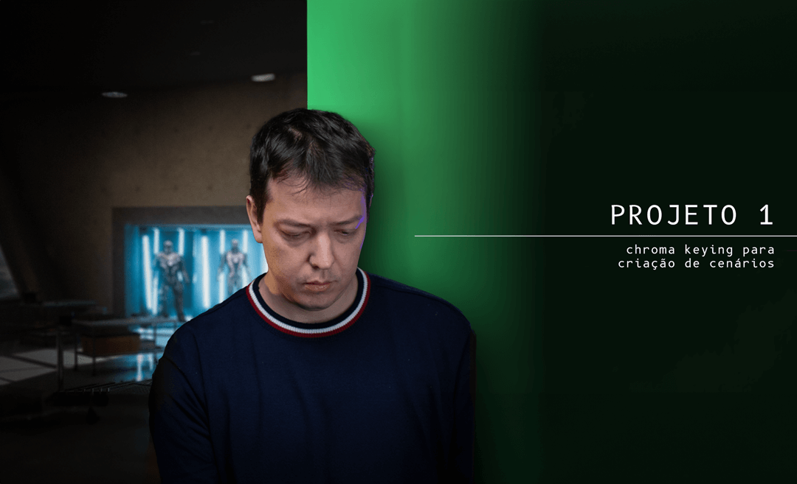
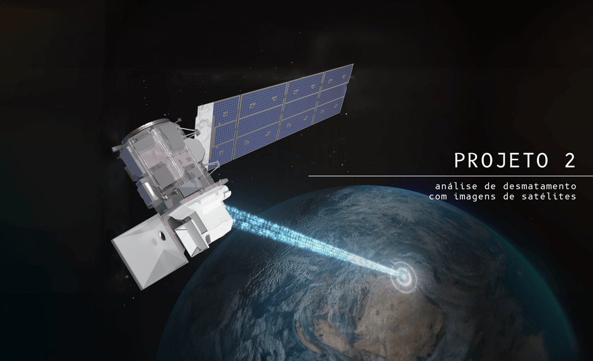
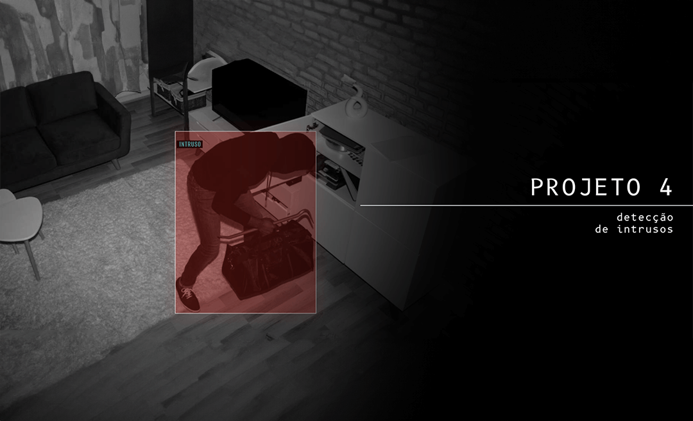

  

  
  
  

  

---

  Olá, sou <strong>Cientista de Dados e Engenheiro de Visão Computacional</strong> em ascensão. Tenho me especializado cada vez mais em data science, com uma atenção especial à Visão Computacional. Minhas habilidades incluem análise de dados,
  e estou empenhado em aprimorar meu conhecimento e aplicá-lo de maneira inovadora.

 
Antes de me tornar Engenheiro de Visão Computacional, me formei como <strong>Técnico em Edificações</strong> e dei inicio a minha graduação de Engenharia Civíl. 

 

### Skills  

  

## 🚀 Projetos

Neste repositório, gostaria de apresentar como se pode transformar dados em insights poderosos e imagens em soluções inovadoras🔥.

<a href="projetos/projeto_01/" title="Detecção e Substituição de Fundo em Vídeos (Chroma Key)"><strong>Chroma Keying para criação de cenários</strong></a>

<strong>Projeto 01</strong> | <strong>Atualizado: 8 Nov 2023</strong>

  Neste primeiro projeto do curso, você irá implementar um algoritmo capaz de identificar e isolar o range de intensidade do fundo verde, e substituí-lo por um cenário alternativo (que pode ser uma imagem estática ou um outro vídeo qualquer...

#

<a href="#" title="Análise de Desmatamento através de Imagens de Satélite"><strong>Análise de Desmatamento através de Imagens de Satélite</strong></a>

<strong>Projeto 02</strong> | <strong>Em Atualização...</strong>

  Neste projeto você irá aprender a usar recursos de sensoriamento remoto para detectar desmatamentos em regiões de florestas. Especificamente, exploraremos imagens do satélite Landsat 8 (OLI/TIRS) usando a biblioteca Google Earth Engine (GEE)... 

#

<a href="#" title="Reconhecimento e Contagem de Moedas"><strong>Reconhecimento e Contagem de Moedas</strong></a>

<strong>Projeto 03</strong> | <strong>Em Atualização...</strong>

  Neste projeto você irá desenvolver um *script* para detectar e identificar diferentes tipos de moedas, além de calcular o valor total das moedas detectadas a partir de vídeos gravaods ou transmissões em tempo real via webcam...

#

<a href="#" title="Alarme para Detecção de Intrusos"><strong>Alarme para Detecção de Intrusos</strong></a>

<strong>Projeto 04</strong> | <strong>Em Atualização...</strong>

  Este projeto tem como objetivo desenvolver um sistema de vigilância utilizando técnicas de processamento de imagem para detectar movimentos a partir de uma câmera externa. Serão utilizadas técnicas para isolar o fundo com uma máscara...
 

### Contato

Para dúvidas, sugestões ou feedbacks:

* **Rian Bispo** - [Contato](https://www.linkedin.com/in/rian-bispo/)
